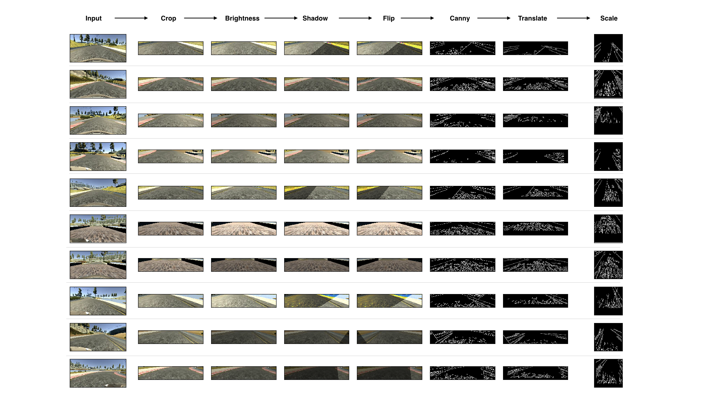
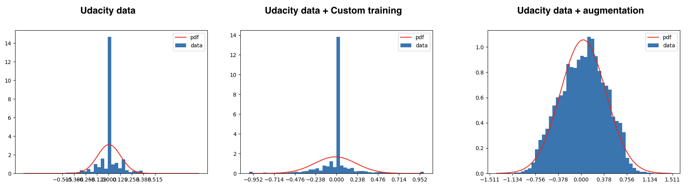

**Behavioral Cloning Project**

The goals / steps of this project are the following:
* Use the simulator to collect data of good driving behavior
* Build, a convolution neural network in Keras that predicts steering angles from images
* Train and validate the model with a training and validation set
* Test that the model successfully drives around track one without leaving the road
* Summarize the results with a written report

## Rubric Points
###Here I will consider the [rubric points](https://review.udacity.com/#!/rubrics/432/view) individually and describe how I addressed each point in my implementation.  

---
###Files Submitted & Code Quality

####1. Submission includes all required files and can be used to run the simulator in autonomous mode

My project includes the following files:
* model.py containing the script to create and train the model
* drive.py for driving the car in autonomous mode
* models/model-49.h5 containing a trained convolution neural network 
* README.md summarizing the results

####2. Submission includes functional code
Using the Udacity provided simulator and my drive.py file, the car can be driven autonomously around the track by executing 
```sh
python drive.py models/model-49.h5
```

####3. Submission code is usable and readable

The model.py file contains the code for training and saving the convolution neural network. The file shows the pipeline I used for training and validating the model, and it contains comments to explain how the code works.

###Model Architecture and Training Strategy

####1. An appropriate model architecture has been employed

I used following model architecture (model.py lines 186-214).

| Layer (type)                 | Output Shape              | Param # |
| ---------------------------- | ------------------------- | ------- |
| lambda_1 (Lambda)            | (None, 64, 64, 1)         | 0       |
| conv2d_1 (Conv2D)            | (None, 30, 30, 24)        | 624     |
| elu_1 (ELU)                  | (None, 30, 30, 24)        | 0       |
| conv2d_2 (Conv2D)            | (None, 13, 13, 36)        | 21636   |
| elu_2 (ELU)                  | (None, 13, 13, 36)        | 0       |
| conv2d_3 (Conv2D)            | (None, 5, 5, 48)          | 43248   |
| elu_3 (ELU)                  | (None, 5, 5, 48)          | 0       |
| dropout_1 (Dropout)          | (None, 5, 5, 48)          | 0       |
| conv2d_4 (Conv2D)            | (None, 3, 3, 64)          | 27712   |
| elu_4 (ELU)                  | (None, 3, 3, 64)          | 0       |
| conv2d_5 (Conv2D)            | (None, 1, 1, 64)          | 36928   |
| elu_5 (ELU)                  | (None, 1, 1, 64)          | 0       |
| dropout_2 (Dropout)          | (None, 1, 1, 64)          | 0       |
| flatten_1 (Flatten)          | (None, 64)                | 0       |
| dense_1 (Dense)              | (None, 100)               | 6500    |
| elu_6 (ELU)                  | (None, 100)               | 0       |
| dropout_3 (Dropout)          | (None, 100)               | 0       |
| dense_2 (Dense)              | (None, 50)                | 5050    |
| elu_7 (ELU)                  | (None, 50)                | 0       |
| dense_3 (Dense)              | (None, 10)                | 510     |
| elu_8 (ELU)                  | (None, 10)                | 0       |
| dense_4 (Dense)              | (None, 1)                 | 11      |

Total params: 142,219

Trainable params: 142,219

Non-trainable params: 0

####2. Attempts to reduce overfitting in the model

The model contains dropout layers in order to reduce overfitting (model.py lines 196, 203, 209). 

The model was trained and validated on different data sets to ensure that the model was not overfitting (code line 224). The model was tested by running it through the simulator and ensuring that the vehicle could stay on the track.

####3. Model parameter tuning

The model used an adam optimizer, so the learning rate was not tuned manually (model.py line 216).

####4. Appropriate training data

Training data was chosen to keep the vehicle driving on the road. I used the dataset provided by Udacity and augmented it as explained in next section.

###Model Architecture and Training Strategy

####1. Solution Design Approach

The overall strategy for deriving a model architecture was to keep the model lightweight to speed-up the training and focus more on training data.

My first step was to use a convolution neural network model similar to the LeNet architecture. I thought this model might be appropriate because I had used it for traffic sign detection and I was familiar with it.

In order to gauge how well the model was working, I split my image and steering angle data into a training and validation set. I found that my first model had a low mean squared error on the training set but a high mean squared error on the validation set. This implied that the model was overfitting. 

To combat the overfitting, I modified the model by adding dropout before the flatten layer and added lambda layer to normalize the input.

Then I came across NVIDIA's self-driving car network architecture as described in this [paper](https://arxiv.org/pdf/1604.07316.pdf), this being popular I adapted this and created an architecture similar to the one used by [Calvenn Tsuu](https://github.com/ctsuu/Behavioral-Cloning#model-architecture-design).

The final step was to run the simulator to see how well the car was driving around track one. The car was still going off the track within few feet of driving, but I know that I needed to focus on my training data and not worry too much about network architecture.

At the end of the training data augmentation process as described below, the vehicle is able to drive autonomously around the track without leaving the road.

####2. Final Model Architecture

The final model architecture is described in **Model Architecture and Training Strategy** above.

####3. Creation of the Training Set & Training Process

I started off with Udacity dataset and added my own data to it. I recorded two clockwise laps and two anti-clockwise laps of center lane driving on first track. I also recorded several instances of recovering from the left side and right sides of the road back to center and several instances of driving through the curve. I also recorded one clockwise and one anti-clockwise lap of the center lane driving on second track.

Even with this dataset, the car still kept going off the road near the lake or after the bridge. I knew that I had to work on data augmentation and have uniform distribution of angle values.

I started off with Udacity dataset and performed this augmentation (model.py lines 91 to 129).
- Split the data into 80% for training and 20% for validation (model.py line 30).
- Randomly pick either center, left or right camera image.
- Apply steering angle correction of +0.25 for left image and -0.25 for right image.
- Crop 70 pixels from the top and 25 pixels from the bottom as this part of the image doesn't contain much useful information.
- Apply random brightness adjustment as described by [Vivek Yadav](https://chatbotslife.com/using-augmentation-to-mimic-human-driving-496b569760a9).
- Apply random shadow as described by [Vivek Yadav](https://chatbotslife.com/using-augmentation-to-mimic-human-driving-496b569760a9).
- Horizontally flip 50% of the images and multiply angle by -1 for flipped images.
- Perform canny edge detection so that the network focuses on and learns from road edges, lane markings and doesn't use less important features such as road surface pattern changes/gradient changes. I used automatic canny algorithm described by [Adrian Rosebrock](http://www.pyimagesearch.com/2015/04/06/zero-parameter-automatic-canny-edge-detection-with-python-and-opencv/).
- Apply random translation between -50 pixels to +50 pixels in both horizontal and vertical directions. Increase steering angle by +0.02 per pixel of translation in horizontal direction.
- Resize the image to 64x64 so that the training is done faster.

Here are few samples from the execution that show augmentation applied at each of the above stages.



Above augmentation resulted in much better distribution of the training data. Here are the histogram plots from original udacity data, my own recorded data and data augmented with above method. You can clearly see how augmentation helps in generating data having gaussian distribution.



I used this training data for training the model. I used training and validation data generators and used 20000 samples per epoch for 50 epochs. Here's a plot of training and validation loss for each epoch.


####4. Runtime Preprocessing

In addition to the training data augmentation, I also added some processing on top of the steering angle predicted by the model when simulator is autonomously driving. I also controlled the throttle based on predicted steering angle. I took reference from [Calvenn Tsuu's](https://github.com/ctsuu/Behavioral-Cloning#model-architecture-design) implementation for this.

Final steering angle sent to the simulator is average of last three values and throttle is controller with formula `throttle = 0.3*0.5/abs(float(steering_angle)*float(speed))` (drive.py line 87 to 94).

